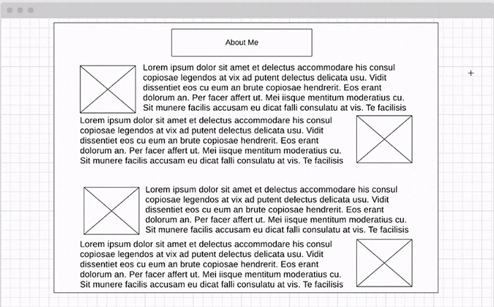

# Blackjack
An interactive game of blackjack

+ Felicia Walcott
+ Chase McFaddin
+ Kyle Atkinson
+ Scott Falbo

+ **javascript**
+ *9/8 Scott and Kyle paired programming*
  + `DeckMaker` makes deck and puts cards in `deckArray`
  + the *player* and *dealer* objects holds current hand and total of held cards.
  + the bet button starts the initial deal.  The `getCard` function deals a card and removes it from the `deckArray` so it cannot be duplicated.  Once pushed the event listener is removed until next turn.
  + The *hit* button adds a card to the player.  If they have 21 the button does not work.
  + the *stay* button calls `dealerTurn()` and turns of the event listeners for *hit* and *stay*.
  
  > We left off on the `calcTotals()` functions.  It is suppose to compare totals and adjust bank roll accordingly.

